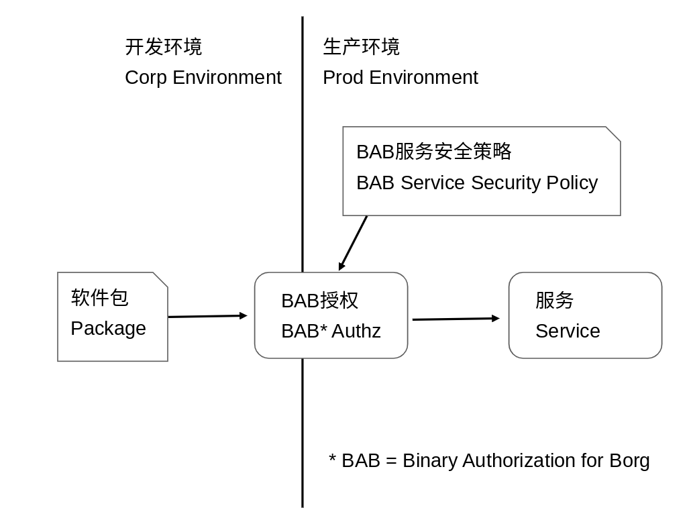
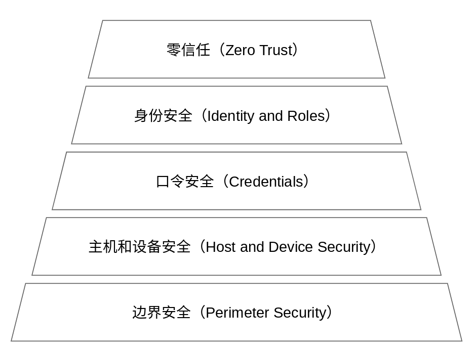
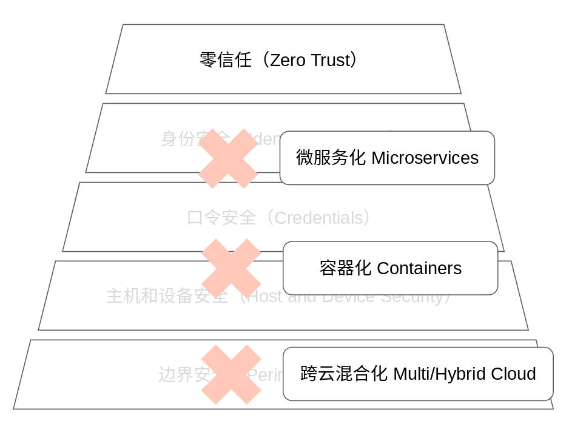
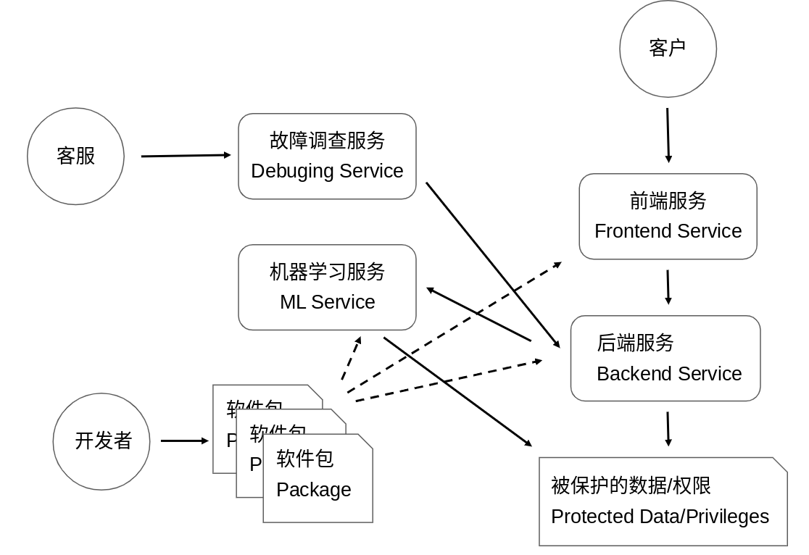
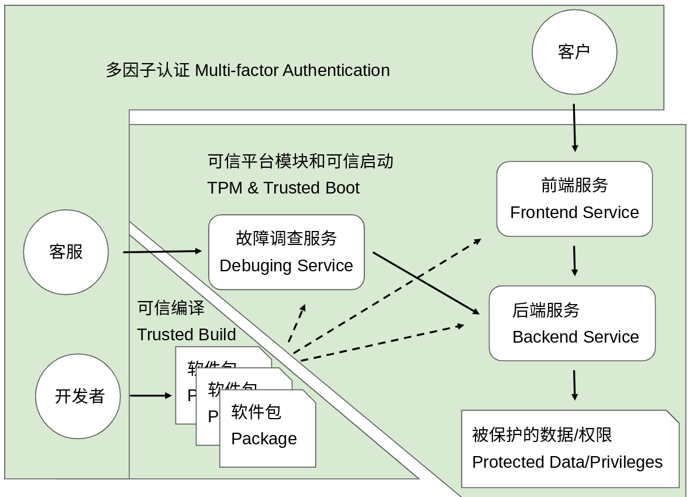
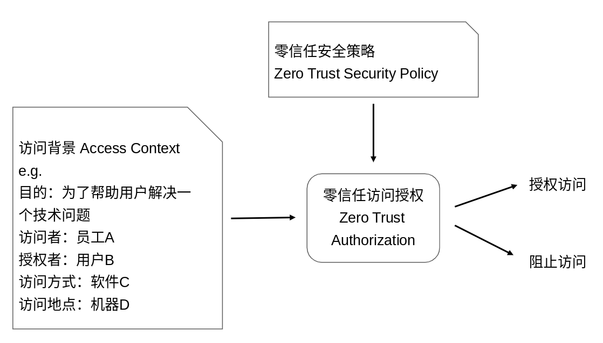
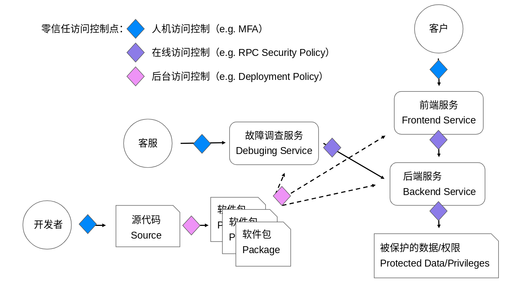
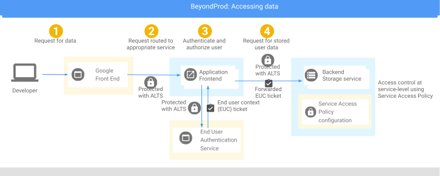
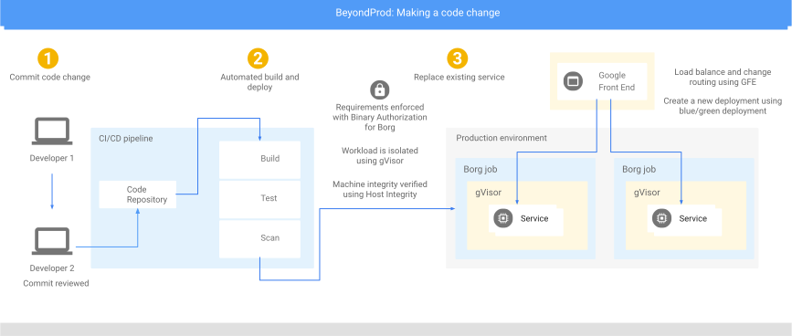

# 零信任实践分享

陈志杰,  前谷歌数据保护团队 Tech Lead, [http://ckev.in/](http://ckev.in/)
Permalink: [https://ckev.in/j/zt/cn.html](https://ckev.in/j/zt/cn.html)
版本：20210708

## 背景介绍

本文的笔者是陈志杰，2015至2020年有幸参与了谷歌生产环境零信任（Zero Trust in Production Environments）的理论和实践。在此背景下开发的 Binary Authorization for Borg （BAB） 系统已经在谷歌生产环境中实现了全面覆盖：任何人在生产环境中以任何服务的身份运行任何软件包之前，都必须为目标服务建立一个足够强的BAB安全策略。不符合BAB安全策略的程序将不会被允许以相应服务的身份运行。

{:width="80%"}

在实现和推广这种生产环境零信任的过程中，BAB团队走了不少弯路，但也收获了很多经验。从2017年开始，BAB团队开始把这些实践经验上升到理论，并陆续发布了一系列的
白皮书（
[BeyondProd](https://cloud.google.com/security/beyondprod)，
[Binary Authorization for Borg](https://cloud.google.com/security/binary-authorization-for-borg), 
[SLSA: Supply-chain Levels for Software Artifacts](https://github.com/slsa-framework/slsa)），
书籍（
[Building Secure and Reliable Systems](https://sre.google/books/building-secure-reliable-systems/)）
以及报告（
[Evolve to zero trust security model with Anthos security](https://www.youtube.com/watch?v=zCVwc3ocYfQ), 
[Zero Touch Prod](https://www.usenix.org/conference/srecon19emea/presentation/czapinski)）。
同时也开始将这种零信任理念推广到更多应用场景，包括公有云上的零信任，公有云自身基础设施的零信任，安卓和Chrome自身及其App的开发零信任。

本次分享的内容全部基于以上谷歌已经公开的资料，并未泄漏谷歌公司机密或者违反任何保密协议。本文中的结论仅代表作者个人观点，并不一定是谷歌官方的观点。

## 什么是零信任

什么是零信任？不同的人很有可能会给出不同的答案。有人说零信任就是工作负载微隔离（Workload micro-segmentation）；有人说零信任就是持续威胁监测（Continous threat monitoring）；有人说零信任就是用对端的信任代替对网络的信任（Trust endpoints, not the network）；还有人说零信任就是双向TLS认证（mTLS）。这些都有道理，但也显然不全面。

在这里，笔者想借用一个关于机器学习的戏谑之辞：“机器学习就是美化了的统计学（Machine learning is glorified statistics）。” 类似的，零信任就是美化了的最小权限（Zero trust is glorified least privilege）。这明显也不准确，因为机器学习和零信任都要比统计学和最小权限更加强调具体的问题和应用场景。机器学习和零信任都不是单一学科和单一理论，而是为了解决实际问题发展起来的在多个领域（比如数学，计算机架构，分布式系统，存储，网络等）的创新实践。

由此可见，我们对于零信任，不必太过拘泥于定义和理论，而是要把它跟实践相结合，从具体的要解决的问题和应用场景出发。所以我们暂时结合本文里的问题和应用场景，将零信任定义为：从要保护的数据和权限出发，对生产环境中的信任的全面削减和重塑（Reduction and reconsruction of trust in production with regard to protected data and privileges)。

比定义零信任更重要的问题是：为什么要做零信任？

## 为什么要做零信任

为什么要做零信任？最本质的，是因为我们有一些重要的数据或者权限需要保护，而现有安全体系在云原生时代已无法提供足够的保护。用户个人隐私数据，员工薪资数据，修改密码的权限，关闭关键系统的权限等等都是被保护的对象。这些数据和权限最初是由基于边界安全（Perimeter Security）的网络接入控制来保护的，比如公司内网和VPN，当一台设备连入公司内网后，就继承了获取这些数据和权限的权利。后来，人们又开始引入基于IP的或者基于用户名密码的访问控制，以及更加细粒度的基于身份和角色（Identity and Role）的访问控制。但是这些已经无法满足在云原生环境下，尤其是像谷歌这样具有复杂的企业IT系统的数据和权限保护的要求。

{:width="80%"}

云原生带来了以下挑战：一是企业IT系统已经从单机房模式进化到了跨云混合（multi and hybrid cloud)的模式，这导致了边界的模糊和基于边界保护的安全的低效；二是基于容器（Containers）的计算导致了宿主机的不确定性，同一个服务可能在不断线的情况下随时从一台物理主机迁移到另一台物理主机，这导致了基于主机的安全防护已经无法进一步实现基于服务逻辑的深层防护；三是微服务（Microservice）和细粒度的API增加了攻击面，身份和角色已经不单单是终端用户的身份和角色，而是微服务之间交互时的更细粒度的身份和访问控制。

{:width="80%"}

从谷歌当时的处境出发，2015年左右时，我们在内部已经实现了比较成熟的基于密钥和身份认证的权限管理系统，但有两个安全威胁引起了我们的注意：一是后斯诺登时代，数据中心的机器之间通信，如何建立互信，如何保证一台被入侵的主机或者一个被入侵的服务不会影响生产环境中的其他部分？二是当我们对单发（One off）的数据和权限访问有了很好的授权和审计系统之后，如何应对像机器学习这样批量（Batch）的数据和权限访问带来的大规模数据泄漏的隐患？建立一个基于零信任的内部风险（Insider Risk）管控系统迫在眉睫。

{:width="80%"}

当然，这一切都基于一个扎实传统安全基本面：网络和主机防护系统，可信启动，密钥管理系统，身份认证和管理系统等等。零信任是基于这个安全基本面的上层建筑。

## 零信任的三要素：信任链，身份2.0和持续访问控制

信任链，身份2.0和持续访问控制是零信任的三大要素。

### 信任链

零信任并不是完全没有信任，而是明确的从几个基本的最小化的信任根（Root of Trust）开始，重构信任链（Chain of Trust）的过程。几个典型的例子包括：多因子认证（MFA，Multi-Factor Authentication）是人的身份的信任根；可信平台模块（TPM，Trusted Platform Module）和可信启动（Trusted Boot）是机器的身份的信任根；而源代码和可信编译（Trusted Build）是软件的信任根。对于一个庞大的IT系统的信任就是从这些最基本的信任根开始，通过一系列的标准化流程（Standard Process）建立的一个完整的信任链（也有人称其为信任树 Tree of Trust 或者信任网 Web of Trust）。

{:width="80%"}

### 身份2.0

身份2.0是对于以上的信任链的标准化，以便于在安全访问策略中使用这些在建立信任过程中收集到的信息。在身份2.0中，一切本体（Entity）都有身份，用户有用户身份，员工有员工身份，机器有机器身份，软件也有软件身份；在身份2.0中，一切访问（Access）都带有多重身份（又称访问背景 Access Context），比如对于数据库中一行数据的访问就会带有类似 “为了帮助用户解决一个技术问题,员工A在用户B的授权下通过软件C在机器D上请求访问” 这样的访问背景。

{:width="80%"}

### 持续访问控制

有了身份2.0提供的丰富的身份和访问背景信息，我们就可以基于此建立一套持续访问控制体系（Continous Access Control）。持续访问控制会在软件开发和运行的各个环节持续地进行访问控制。几个典型的例子包括：在员工登录时要求提供多因子认证；在部署软件时要求软件是从信任的源码库在安全的环境中编译而来，并经过代码评估（Code Review）；在主机之间建立连接时要求双方提供主机完整性证明；在微服务获取特定用户数据时要求提供该用户的授权令牌（Authorization Token）。

{:width="80%"}

## 零信任部署实例

在本节中，我们提供两个具体的零信任部署实例：第一个是用户如何获取自己的数据（图中的Developer实际应为User），第二个是开发者如何通过修改源代码来改变生产环境中的数据访问行为。谷歌对这两个案例的数据访问控制都遵循零信任的原则。

### 用户访问自己的数据

略

{:width="80%"}

### 开发者改变软件数据访问行为

略

{:width="80%"}

## 实践经验和教训

### 以人为本，从流程中建立信任

在用BeyondCorp实现开发环境（Corp Environment）的零信任时，我们以人为本，对员工进行身份管理和多因子认证。与此同时，我们建立了一套管理公司设备的流程，每个公司设备都配备TPM模块和操作系统完整性验证。这两项工作确保了正确的人用正确的设备提供可信的认证信息。最后，我们再利用这些认证信息对员工访问开发环境进行持续访问控制。

在用BeyondProd实现生产环境（Prod Environment）的零信任时，我们同样试图以人和流程作为信任的根本。BeyondProd面对的问题是，生产环境并不存在与人的直接交互，于是我们建立了一套把生产环境中的软件溯源到这些软件的开发者（Software Provenance)，从对开发者的认证和开发流程的加固开始，确保没有任何单人能够改变生产环境中的软件的行为（No Unilateral Change)。

### 安全规则等级

罗马不是一天建成的，推广零信任同样是一个渐进的过程。为了量化和激励安全改进，我们用安全规则等级来衡量一个安全规则是否比另一个安全规则“更安全”。比如，在Binary Authorization for Borg体系中，我们引入了以下安全等级：

安全等级〇：无保护。此为最低的安全等级，代表该服务完全不被BAB保护。这种情况有可能是因为该系统没有任何敏感权限，也有可能因为该系统使用了其他的与BAB等价的保护。

安全等级一：可审计的代码。此等级的安全规则能够确保相应服务所用的软件是在一个安全可验证的环境中由已知的源代码编译而来。

安全等级二：可信的代码。此等级的安全规则在能确保安全等级一之外，还能确保相应服务所用的软件是由特定代码库（比如Gmail自己的代码库）中的经过代码评估（Code Review）和测试的代码编译而来。截至2020年2月，该等级为所有谷歌服务默认的保护等级。

安全等级三：可信的代码和配置。此等级的安全规则在能确保安全等级二之外，还能确保相应服务所用的配置文件也像代码一样经过了同样的安全流程（Configuration as Code）。截至2020年2月，该等级为所有谷歌重点保护服务的默认等级。

### 报警制和授权制

在推广零信任的过程中，为了给各方提供一个平缓的迁移体验，我们并没有直接禁止所有不符合安全规则访问，而是在安全规则本身中提供报警制和授权制两个模式。在报警制下，违反安全规则的访问并不会被阻止，而是会被记录并报警给相关人员，而在授权制下，违反安全规则的访问会被立即阻止。这种双体制的存在既给人机会根据报警不断迭代和改进不合规的行为，又在不合归的行为被杜绝后提供有效的机制收紧安全规则并防止回归（Regression）。

### 要安全也要稳定

零信任的复杂度决定了其在保持系统稳定性（Reliability）上也会面临新的挑战。在实践零信任的过程中，我们为大多数场景提供了应急破壁机制（Break-glass Mechanism）。这保证了在紧急情况下，操作员能够打破零信任系统的限制进行一些复杂的应急操作。为了持续保障安全，一旦应急破壁机制被调用，安全团队会立刻收到报警，在破壁机制下的所有操作也会被详细记录在安全日志中。这些安全日志会被仔细审查以验证破壁的必要性。这些安全日志也会帮助设计新的零信任特性以避免在类似情况下再次调用应急破壁机制。

### 关注内部风险

从防御的角度来讲，内部风险是外部风险的超集：当攻击者攻陷任何一个内部人员（合法用户或员工）的设备后，攻击者便成了内部人员。零信任从这个角度看就是假设任何一台主机都有可能被攻陷。

### 安全基础建设

零信任的实施依赖于扎实的基础安全架构，没有基础就没有上层建筑。谷歌零信任依赖于以下基础设施提供的基本安全保障：

1. 数据加密和密钥管理（Encryption and Key Management）
2. 身份和访问管理（Identity and Access Management）
3. 数字化人力资源管理（Digital Human Resource）
4. 数字化设备管理（Digital Device Management）
5. 数据中心安全（Data Center Security）
6. 网络安全（Network Security）
7. 主机安全（Host Security）
8. 容器隔离（Container Isolation，gVisor）
9. 可信启动（Trusted Boot）
10. 可验证编译（Verifiable Build）
11. 软件完整性验证（Software Integrity Verification）
12. 双向TLS（mTLS）
13. 基于服务的访问策略（Service Access Policy）
14. 终端用户令牌（End User Context Tokens）
15. 配置即代码（Configuration as Code）
16. 标准化开发和部署（Standard Development and Deployment）

### 其他

除以上经验教训外，从小规模开始迭代（Start small, then iterate），多层安全（Defense in depth），量化安全投资回报（Quantify return over investiment），通过标准化降低成本（Lowering cost through homogeneity），安全左移（Shifting left）等等，也是我们在实践中积累下来的准则，在此不再赘述。

## 结论

做好零信任，20%靠理论，80%靠实践。零信任的实践方案并不唯一，笔者希望通过分享以上的一例零信任实践，达到抛砖引玉的目的。欢迎大家批评指正！我的邮箱可以在我的[个人主页](https://ckev.in/)上找到。

